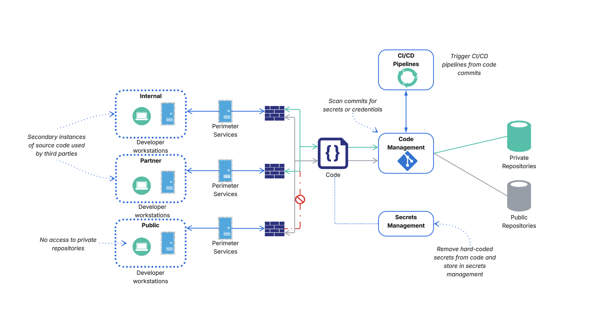

## Session 1

Session 1 will cover Source Code Management basics and best practices for various scenarios.

### Introduction 

What is Source Code Management (SCM)? The dictionary-definition of SCM, also known as version control, refers to the practice of tracking and managing changes to a software project's source code. SCM underlies a core component of building software applications in modern cloud environments. 

The following diagram describes a very common real-world scenario for a large organization with remote developers, partners, and third-party contractors may all be accessing source code at the same time.

The diagram highlights some unique operational challenges when it comes to managing source code. How do we support collaboration with a geographically distributed development team? Are we setup to properly handle code conflicts? When is it OK to automate tasks vs human decision making?

Aside from operations, we need to ensure our code build process aligns to industry standard best practices to prevent security issues. We must ask, who has access to our repositories? How do we administer user access? What is our token/secret revocation process? Are keys automatically rotated? Do we have audit logging enabled for reviewing access logs?

These are only a few of the relevant questions that need to be addressed when designing or re-reviewing your organization's SCM architecture. In the following sections, we'll discuss these questions in more detail along with many others. 
