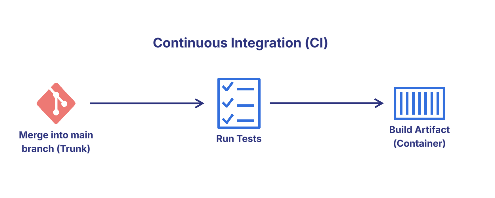
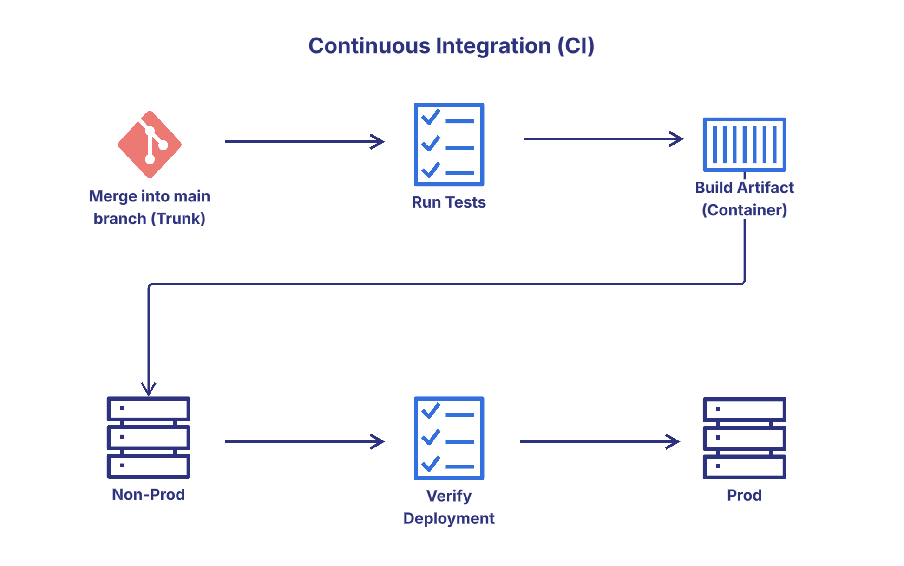
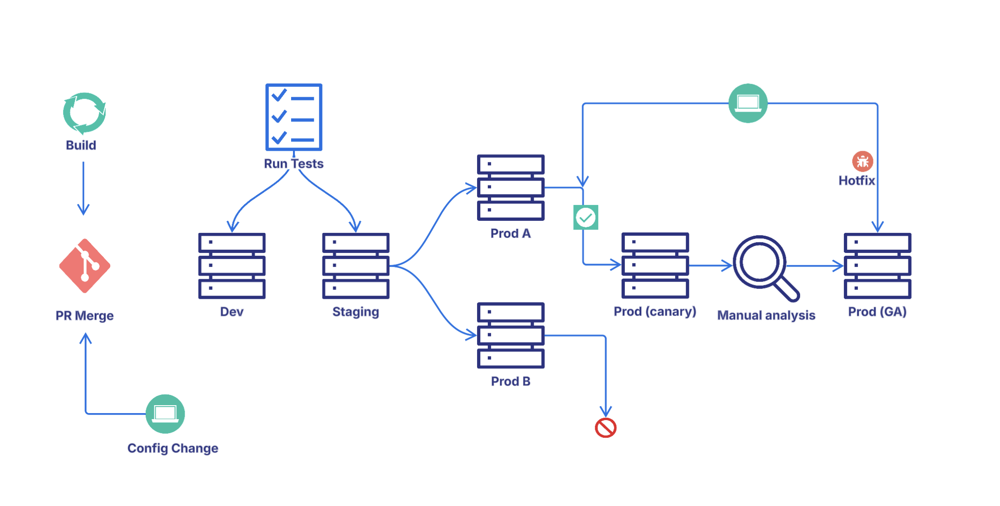
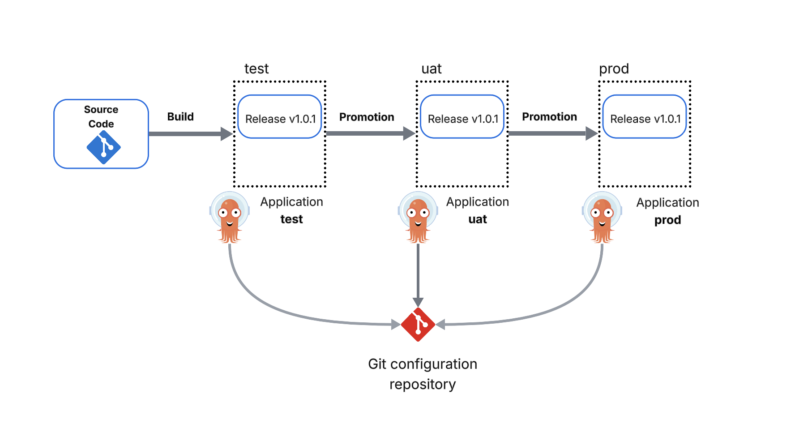
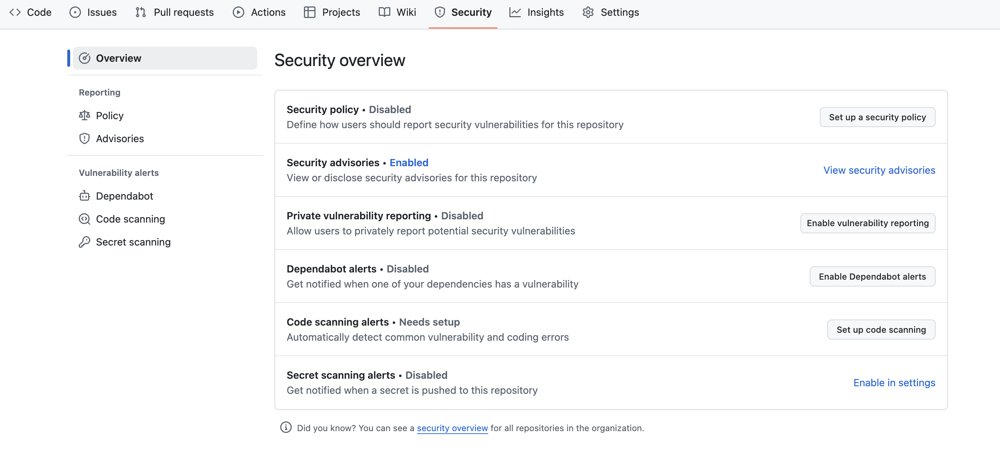
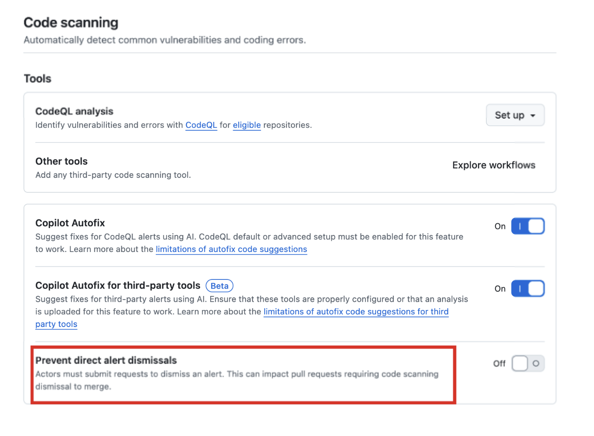

### Overview

During this discussion, we'll talk about basic source code management practices. Some you may be familiar with, some may be newer concepts. The goal is to re-inforce and re-introduce those concepts. Many of the topics we will discuss in this workshop are standards defined by the Open Source Security foundation (https://best.openssf.org/)

#### **CI/CD**
##### Don't allow workflows to approve pull requests

While automation is critical to handling repetitive tasks and tasks that don't require human input or approval - it also frees up developers to focus on more critical areas, rather than building infrastructure or updating configuration files manually - automation workflows should be used only in specific build scenarios. 


##### Restrict workflows to specific repos

This is a security recommendation. Automation workflows are particularly dangerous in that if scoped too broadly, they could be run arbitrarily against any repository in the organization. Workflows should always be built with a specific purpose in mind, and then applied to only the workflows that require that action. 

If every user can run arbitrary workflows, this could enable malicious activity such as accessing organization secrets, crypto-mining, etc. This misconfiguration could lead to the following attack:

Prerequisite: the attacker is part of your GitHub organization
Attacker creates new repository in the organization
Attacker creates a workflow file that reads all organization secrets and exfiltrate them
Attacker triggers the workflow
Attacker receives all organization secrets and uses them maliciously

Solution:
Change “All repositories” to “Selected repositories” and select repositories that should be able to run actions

##### Set Default Workflow Token Permissions to Read Only (tj-actions)

Let's talk about tj-actions. What happened? Why? tj-actions/changed-files is a popular action for identifying which files have changed in a pull request or commit. In March of this year, it was confirmed that threat actors had spoofed Renovate bot - another popular dependency tool for code analysis - through a compromised GitHub PAT and impersonated Renovate's commit style to obfuscate the attack. Most likely, Renovate was targeted because the most recent commit was from Renovate. 

The Renovate bot committed to the tj-actions/changed-files repository and injected a malicious commit into a legitimate pull request. This commit was then automatically merged due to the repository's workflow configuration. The attacker also pushed new git tags that pointed to the malicious commit, effectively compromising the action. 

As a result, a change was deployed to all versions of the Action that printed environment variables (build secrets) to the logs of the job. Below is an example of how ts-actions was used:

```
name: Check Changed Files

on:
  pull_request:
    branches: [ main ]

jobs:
  check-changes:
    runs-on: ubuntu-latest
    steps:
      - uses: actions/checkout@v4

      - name: Get changed files
        id: changed-files
        uses: tj-actions/changed-files@v44

      - name: Run tests if Python files changed
        if: steps.changed-files.outputs.any_changed == 'true'
        run: |
          echo "Changed files: ${{ steps.changed-files.outputs.all_changed_files }}"
          # Run your commands, e.g. pytest
          pytest
```


Based on what we know about the script before it was removed by GitHub, the attacker only printed env vars to logs, so you would only be effected if your logs/repo were publicly available.

How can this be prevented? There are a few learnings that can be applied. 

###### Pinning to Commit SHAs:
Instead of relying on version tags (like v1), which can be changed by the action maintainer, users should pin GitHub Actions to specific commit SHAs. This ensures that only a known, trusted version of the action is used, preventing malicious updates from being automatically pulled. 

###### Using Allow-list:
GitHub's allow-list feature allows organizations to restrict the actions that can be used in their workflows. This prevents unverified or potentially malicious actions from being used, reducing the attack surface. 

###### Auditing Workflows:
Regularly auditing workflows and checking logs for suspicious activity, such as unusual network requests, can help detect and prevent unauthorized actions. 

###### Runtime Monitoring:
While static scanning can identify potential issues, it may miss malicious behavior that occurs at runtime. Using runtime monitoring tools can detect abnormal network calls or suspicious file modifications within CI/CD jobs. 

###### Limiting Permissions:
Restricting the default permissions for actions, particularly for write access, can limit the potential impact of a compromise. Setting policies and permissions to be as restrictive as possible can help mitigate the risk. 

###### Internal Actions:
Utilizing internal actions specific to your use case, with restricted access for modification, can prevent unauthorized changes and reduce the risk of external vulnerabilities. 


##### Promote builds effectively

CI is designed with frequent, small iterations in mind and automating the testing. 



It's a cornerstone of Continuous Delivery, where the goal is to streamline the software release process. 



As more organizations move to the cloud, they adopt more complex workflows given the efficiency and robustness that cloud providers offer. Microservices, containerization, and automation & orchestration add more complexity than traditional CI/CD tools. Each microservice may be managed differently or independently of others, may have their own software life cycle and dependency chains, which can lead to difficulty managing. 

This creates branches in development, splits teams off into separate projects, and de-prioritizes collaboration as each of those teams are only focused on their own project. As a result, consistency across environments - such as dev, QA, staging - becomes more challenging. 



For those reasons, CI/CD has given rise to a newer concept referred to as Continuous Promotion (CP). The goal of continous promotion is to centralize the decision-making process for elevating builds into different environments. 



Tools like Kargo and Devtron are popular CI/CP tools for helping dev teams coordinate the release of new code in each stage or environment for Kubernetes deployments.  Tools like JFrog Artifactory and Jenkins are widely used for build automation, deployment, and promotion of containerized applications or monolithic applications. Jenkins utilizes a Build Promotion plugin, while Jfrog has build promotion operations built-in and can be triggered via APIs, the CLI, or CI integrations. See below for more detail on each:

**[Kargo](https://kargo.io/)**

**[Devtron](https://devtron.ai/)**

**[JFrog](https://jfrog.com/help/r/how-does-build-promotion-work/artifactory-how-does-build-promotion-work)**

**[Jenkins](https://plugins.jenkins.io/promoted-builds/)**

#### **Access Control**

##### Enable two-factor authentication

Two-factor authentication is the bare minimum in terms of security standards these days. Organization SSO with biometric verification - such as Okta fastpass - is highly preferred. 

##### Enable fewer than 3 organization admins

This is all about least privilege. The more admins you have, the more cooks there are in the kitchen. Generally, at least 1 org admin should be available for granting access to collaborators, creating new repositories, setting up integrations, and updating repo permissions as needed. The more admins you have walking around with this level of permission, the greater the potential blast radius of a compromise becomes. 

##### Ensure org admins are active

If a user has org admin privileges and doesn't login, that means they don't need org admin because they're not being asked to perform administrative functions, or someone else is handling that responsibility. 

#### **Repository Configuration**

##### Don't allow committer aprovals

This is a big one, and frankly one that is still prevanlent in our industry. For small boutiques and mom and pop shops, it's not unusual to have a single developer, security architect, or devops persona maintaining code for a retail or internal application. Apprving your own commits is tantamount to grading your own math test. If you don't understand the math, you're not in a position to objectively approve of the answers. Having at least 1 peer reviwer of the code is bare minimum in terms of best practices. 

##### Require at least 2 reviewers

As stated in the previous section, peer review is a critical practice because it invites collaboration and education opportuntities. Even if you are the only developer, and you've written the guidelines, having a peer review your commits and ensure that you've actually stayed within the guidelines helps to protect you and the organization. 


##### Don't merge pull requests unless all checks pass

Checks exist for a reason. Whether it's merge conflicts, code scanning, or linting for clean code, ensuring all checks pass means that you're following guidelines set by the organization to ensure the quality and security of the products you release. 

Occasionally, compliance checks can fail on strict criteria. An example of this could be broad permissions on an IAM role policy, and the compensating control would be a conditional rule in the policy such as an external ID.

Decisions about compensating controls and/or exemptions should always be documnted in the accompanying ticket or change artifact so that it's clear during routine audits or legal review why the checks were bypassed. 

##### Never rewrite Git history

Just don't do this. 


No, Shia. The energy is great, but the consequences are not so great. In local branches, it's perfectly acceptable. Once the code has been committed to a shared repository, this can create a lot of problems for developers collaborating on that code and can result in conflicts with downstream branches when they are pushed to main. 

This question often arises when secrets are unintentionally leaked to shared repositories. In almost every scenario, it's advised to disable / delete the secret key - rather than attempt to rewrite git history - which is an incredibly dangerous operation.

You can use tools like git rebase or git commit --amend to clean up your local history, squash commits, change commit messages, or reorder them. This can make the history easier to understand and review before sharing. 

#### **Operations Management**
##### Configure Security Alerts and Vulnerability Scanning at the Organization or Repository Level 

GitHub, for example, has some wonderful built-in mechanisms that can improve the overall security and safety of your repositories. Not all security settings are enabled by default, and some require GitHub Advanced Security. Let's go over some of the features:



###### Security Policy
A security policy helps security researchers understand who to contact in the event of a security issue. If there are no clear instructions about who maintains the repository or who to contact in the event an issue arises, the reporter may feel they have a repsonibility to publicly disclose by raising a public issue or posting on social media. Responsible disclosure is for the greater good, so don't think anyone will lose sleep over your hurt feelings.  

###### Security Advisories
Repository owners, organization owners, security managers, and users with the admin role can collborate on security issues privately and work towards resolution. 

###### Private vulnerability reporting
Allows users to report security vulnerabilities in your repository based on the security policy you have defined.

###### Dependabot alerts 
These alerts can be configured to notify repository owners when there are vulnerabilities detected in your dependencies. You can also manually generate Dependabot pull requests to resolve these vulnerabilities.

###### Code scanning alerts
Requires GitHub Advanced Security. Adds tools for static analysis, software composition analysis, and secret scanning to the GitHub platform.

###### Secret scanning alerts 
Requires GitHub Advanced Security. Adds tools for static analysis, software composition analysis, and secret scanning to the GitHub platform.

##### Other Settings
GitHub Advanced Security has some wonderful options for security guardrails, including an option to prevent users from dismissing alerts that might be required to merge pull requests. Without this setting, users can ignore checks that fail when PRs are scanned and merge the PR anyway, completely disregarding the security implications altogether.



#### Use single-sign-on 
Not using an SSO solution makes it more difficult to track a potentially compromised user’s actions accross different systems, prevents the organization from defining a common password policy, and makes it challenging to audit different aspects of the user’s behavior

#### Webhooks Should Be Configured To Use SSL
If SSL verification is disabled, any party with access to the target DNS domain can masquerade as your designated payload URL, allowing it freely read and affect the response of any webhook request. In the case of GitHub Enterprise Server instances, it may be sufficient only to control the DNS configuration of the network where the instance is deployed, as an attacker can redirect traffic to the target domain in your internal network directly to them, and this is often much easier than compromising an internet-facing domain.

#### Limit public repository creation to Admins
The organization should be configured to prevent non-admin members creating public repositories. Creating a public repository may expose sensitive organization code, which, once exposed, may be copied, cached or stored by external parties. Therefore, it is highly recommended to restrict the option to create public repositories to admins only and reduce the risk of unintentional code exposure. 

**NOTE**: You should also verify that repositories owners can’t change existing repositories visibility to be public. If allowed, a malicious user could create a private repo and change it to public.

Congratulations! You've made it to the end... of day 1. 


You've completed this brief introductory lesson! You can move on to the next lesson. 