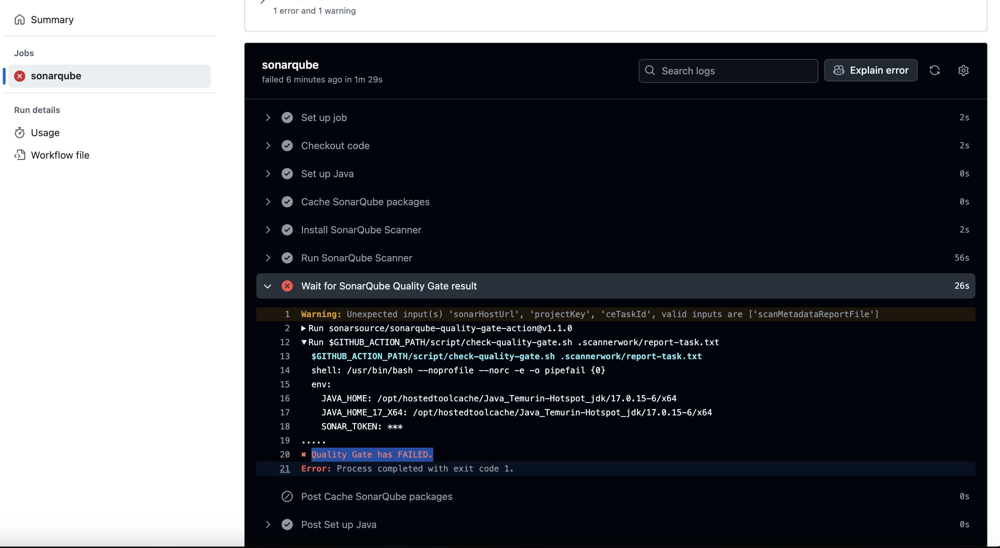

## So, how do we fix this?

In the last sections, we looked at SAST and SCA tools and some compelling reasons why they should be a part of the code security strategy for every organization. The labs were intended to be more manual to showcase the underlying mechanics of how these tools work, rather than relying solely on automated pipelines. 

By taking a hands-on approach, you gained insight into the types of issues these tools detect, how to configure them for real-world projects, and how to interpret their output. This manual exploration lays the groundwork for integrating SAST and SCA into CI/CD workflows, enabling more scalable and consistent security practices across teams and projects.

In the following section, we will look at an example of how to automate these processes to streamline remediation efforts. 

### GitHub Actions

GitHub actions is one of the most popular approaches for implementing automation into build processes, especially when it comes to security. GHA can be used to enforce compliance on builds that don't pass basic checks, and they don't even have to be security focused. Linting, simplicity, and functionality are all reasons to implement automations to perform checks that validate the code is free of error. 

Further, humans are error prone. We make mistakes when we stare at the screen too long. By having automated checks at every stage of the build, deploy, and release cycles, we can prevent major problems from surfacing and ultimately reduce the overhead for developers as they'll have less code to re-review and fix in the long run. 

1. We previously set up a GitHub action for an OWASP ZAP scan of our live running application. Now let's set up a GitHub action for our WebGoat and Juice-Shop projects to run the sonar-scanner cli tool and generate a SAST scan. 

2. In our local juice-shop directory, change directories to .github/workflows and create a file called sonarqube-action.yml. Paste the following action code into the file:

```
name: SonarQube Scan

on:
  push:
    branches:
      #- master
  pull_request:
    branches:
      #- master
      #- dev

jobs:
  sonarqube:
    runs-on: ubuntu-latest
    environment: SONAR
    steps:
      - name: Checkout code
        uses: actions/checkout@v3

      - name: Set up Java
        uses: actions/setup-java@v3
        with:
          distribution: 'temurin'
          java-version: '17'  # match your project

      - name: Cache SonarQube packages
        uses: actions/cache@v3
        with:
          path: ~/.sonar/cache
          key: ${{ runner.os }}-sonar

      - name: Install SonarQube Scanner
        run: |
          curl -sSLo sonar-scanner.zip https://binaries.sonarsource.com/Distribution/sonar-scanner-cli/sonar-scanner-cli-5.0.1.3006-linux.zip
          unzip sonar-scanner.zip
          sudo mv sonar-scanner-5.0.1.3006-linux /opt/sonar-scanner
          echo "/opt/sonar-scanner/bin" >> $GITHUB_PATH

      - name: Run SonarQube Scanner
        env:
          SONAR_TOKEN: ${{ secrets.SONAR_TOKEN }}
        run: |
          sonar-scanner \
            -Dsonar.projectKey=juice-shop-copy \
            -Dsonar.sources=. \
            -Dsonar.host.url=http://<sonarqube-url> \
            -Dsonar.token=$SONAR_TOKEN
```

3. Notice we've commented out the run paramters at the top. We just want this to run on the initial commit to our repo, but you can modify and tweak these parameters to your heart's content. In a real-world scenario, you want to be consistent about scanning commits and pull requests so that issues are effectively mitigated as further downstream as possible. 

4. Commit the changes to your repo and watch the action run!


### Prevention 

So far, we've looked at how to successfully scan the code both locally and on commit. Now, how do we ensure this code is cleaned before merging? We can use SonarQube's built-in DevOps platform integration with GitHub to connect directly to our Juice-Shop repo and run a quality gate on the pull request. 

We could modify our actions workflow file to include pull requests, but since the scan would run after the PR, there's no automation in place to block the PR. Using the built-in integration, we can do just that!

#### Create a Quality Gate

1. We're going to configure a new quality gate in SonarQube that will evaluate our builds and pass or fail them accordingly. We can then use these pass/fail statuses in our GitHub actions to gait our builds. This means you can effectively prevent builds from passing to the next stage if they don't pass the criteria you've set. A good starting point would be to block anything that's identified as a Blocker (Critical) or High. 

2. Login to SonarQube and navigate to Quality Gates in the top nvigation pane.


3. Provide a name, such as CI/CD and click "Create."


4. Click on the new quality gate, and look for an option that says "Unlock editing" and click it. Scroll back up and click "Add Condition." 


5. Create conditions for Blocker and High severity issues.


6. Don't forget to set your new quality gate as the default


7. We can now apply this quality gate to our builds. 

##### Explanation

When configuring PR scanning in SonarQube or similar tools, you often have two analysis strategies to choose from: "On New Code" and "On Overall Code." Each approach has different implications from a DevSecOps and security risk management perspective. Here's a breakdown of both:


###### Scanning Strategy: On New Code

| **Category**         | **Details**                                                                                                                                                     |
|----------------------|------------------------------------------------------------------------------------------------------------------------------------------------------------------|
| **Description**       | - Scans only code changed in the pull request (new or modified files).<br>- Enforces clean code standards and security checks for recent contributions.         |
| **Security Implications** | - **Proactive**: Prevents introduction of new vulnerabilities.<br>- **Fast Feedback**: Optimized for CI pipelines.<br>- **Compliance Friendly**: Supports shift-left security. |
| **Best Use Cases**    | - Teams using CI/CD.<br>- Legacy codebases with a "leave the campsite cleaner" mindset.<br>- Gate merges to block new security issues.                         |
| **Risks**             | - **Blind Spots**: Doesn't detect issues in unchanged legacy code.<br>- May cause a false sense of security if base code is insecure.                          |


###### Scanning Strategy: On Overall Code

| **Category**         | **Details**                                                                                                                                                                |
|----------------------|-----------------------------------------------------------------------------------------------------------------------------------------------------------------------------|
| **Description**       | - Scans the entire codebase, including both new and existing code.<br>- Every pull request triggers analysis of all source files.                                           |
| **Security Implications** | - **Thorough**: Finds vulnerabilities anywhere in the codebase.<br>- **High-Assurance**: Great for environments needing full visibility.<br>- Ideal for audits and critical systems. |
| **Best Use Cases**    | - Early-phase projects or full security audits.<br>- Mature security programs with strict policies.<br>- Apps handling trusted or sensitive data (PII, PCI, HIPAA, etc.).   |
| **Risks**             | - **Performance Hit**: Full scans on every PR slow down CI.<br>- **PR Noise**: Developers may face unrelated legacy issues.<br>- May hinder incremental code cleanup.      |


###### Recommended Strategy

| **Goal**                                  | **Recommended Approach**                                                 |
|-------------------------------------------|--------------------------------------------------------------------------|
| Prevent new vulnerabilities               | On New Code                                                              |
| Comprehensive visibility and risk posture | On Overall Code                                                          |
| Combine security and agility              | Use On New Code in CI, and run On Overall Code on a schedule (e.g., nightly or weekly scans) |


###### Hybrid Approach (Best of Both)

-Use "On New Code" for pull requests, enabling developers to push secure changes quickly.
-Use "On Overall Code" in scheduled scans (e.g., nightly or weekly jobs) or before major releases to catch issues in older parts of the codebase.

#### Create the GitHub App

1. In order to onboard our GitHub account to SonarQube, we need to create a GitHub Application and the required secret and private key. Navigate to your Github organization settings page and click on "Developer Settings."

2. Click on "GitHub Apps" and in the right-hand corner, click the option for "New GitHub App."

3. Enter the following parameters:

- GitHub App name: *The name of your GitHub app*
- Homepage URL: *This is the URL of your SonarQube instance*
- Callback URL: *This is also the URL of your SonarQube instance*

4. Make sure the option for "Expire user authorization tokens" is checked. 

5. Uncheck the "Active" box under Webhook. 

6. Under the "Permissions" section, please refer to the following documentation for which actions to allow: https://docs.sonarsource.com/sonarqube-community-build/devops-platform-integration/github-integration/setting-up-at-global-level/setting-up-github-app/

7. Additionally, add Read & Write permission for "Pull Requests."

8. At the bottom of the page, under "Where can this GitHub App be installed?," select "Only on this account."

9. Click "Create GitHub App."


10. Back under Developer Settings, edit the newly created GitHub App.


11. Make note of the App ID and Client ID, you'll need these later. 

12. Under "Client Secrets", create a new secret. Similarly, under "Private Keys" click "Generate a private key." A PEM file will be downloaded for you. Copy this to a secure location.

13. When creating a DevOps Platform integration for GitHub in SonarQube, both the private key and client secret are required fields — but they serve different purposes, depending on which type of integration you're setting up. 

14. The Private Key is used to authenticate as the GitHub App so SonarQube can interact with GitHub securely on your behalf. The Client Secret is used with the Client ID to authenticate OAuth flows for user login or other API requests as an OAuth app. 


#### Create the Integration

1. Navigate to Administration > Configuration > DevOps Platform Integrations. 


2. Select GitHub, and click on "Create configuration." A new window will pop up that will ask for details regarding your newly created GitHub app. Enter the following details:

- Configuration name: *The name of your config*
- GitHub API URL: *https://api.github.com is the default for Github.com*
- Client ID: *The client id you copied earlier*
- Client Secret: *The client secret you copied earlier*
- Private Key: *upload the PEM file you downloaded earlier*

3. Click "Save configuration."


#### Test the Integration

Now that we've got the app created, and the integration details added into SonarQube, we can test the integration by simulating blocking a pull request. PR comments are not supported in the free version of Sonar Community, but we can show how the GitHub action would run and what the end result would be. 

1. In your local juice-shop directory, make sure you're working in a branch such as dev or test, and replace the sonarqube-action.yml we created earlier with the version below:

```
name: SonarQube Scan

on:
  push:
    branches:
      - master
      - dev
      # add any other branches you may be working with
  pull_request:
    branches:
      - master
      - dev
      # add any other branches you may be working with

jobs:
  sonarqube:
    runs-on: ubuntu-latest
    environment: SONAR
    steps:
      - name: Checkout code
        uses: actions/checkout@v3

      - name: Set up Java
        uses: actions/setup-java@v3
        with:
          distribution: 'temurin'
          java-version: '17'

      - name: Cache SonarQube packages
        uses: actions/cache@v3
        with:
          path: ~/.sonar/cache
          key: ${{ runner.os }}-sonar

      - name: Install SonarQube Scanner
        run: |
          curl -sSLo sonar-scanner.zip https://binaries.sonarsource.com/Distribution/sonar-scanner-cli/sonar-scanner-cli-5.0.1.3006-linux.zip
          unzip sonar-scanner.zip
          sudo mv sonar-scanner-5.0.1.3006-linux /opt/sonar-scanner
          echo "/opt/sonar-scanner/bin" >> $GITHUB_PATH

      - name: Run SonarQube Scanner
        id: scan
        env:
          SONAR_TOKEN: ${{ secrets.SONAR_TOKEN }}
        run: |
          sonar-scanner \
            -Dsonar.projectKey=juice-shop-copy \
            -Dsonar.sources=. \
            -Dsonar.host.url=<sonar-url> \
            -Dsonar.token=$SONAR_TOKEN

          # Extract ceTaskId from the generated report
          echo "ceTaskId=$(grep ceTaskId .scannerwork/report-task.txt | cut -d'=' -f2)" >> $GITHUB_OUTPUT

      - name: Wait for SonarQube Quality Gate result
        uses: sonarsource/sonarqube-quality-gate-action@v1.1.0
        with:
          sonarHostUrl: <sonar-url>
          projectKey: juice-shop-copy
          ceTaskId: ${{ steps.scan.outputs.ceTaskId }}
        env:
          SONAR_TOKEN: ${{ secrets.SONAR_TOKEN }}

```

2. This new version of the action is actually two steps:

**Step 1**: Run sonar-scanner
This uploads the analysis to your SonarQube server and generates .scannerwork/report-task.txt, which includes the background task ID (ceTaskId).

**Step 2**: Run the sonarqube-quality-gate-action
This waits for the background task to complete and then checks the quality gate status (pass/fail). It reads from .scannerwork/report-task.txt.

3. Commit the code to your branch and after a few minutes you'll see that the GitHub action failed due to the quality gate we created. 




##### How to Enforce This Behavior

###### Use the sonarsource/sonarqube-quality-gate Action
This action waits for the analysis to complete and checks the Quality Gate status.

###### Fail the workflow on gate failure
The action fails if the gate fails, which blocks the PR if the workflow is marked as “required.”

###### Mark the workflow as “required” in GitHub:
1. Go to your repository → Settings → Branches → Branch protection rules
2. Add a rule for main, master, or any protected branch.
3. Enable “Require status checks to pass before merging.”
4. Add the name of your GitHub Actions workflow (e.g., SonarQube Scan) as a required check.


#### Summary

This session included quite a lot of steps! Hopefully, what you've learned up to this point is that code security doesn't have to be hard. It's about ensuring we work smarter, not harder! We want to enable collaboration between security and devops and work towards a common goal. There are lots of nuances we simply don't have time to get into here, but even "some" of the practices we've discussed here so far are better than none at all!

We're officially finished with this lesson. Happy Secure Coding! 

