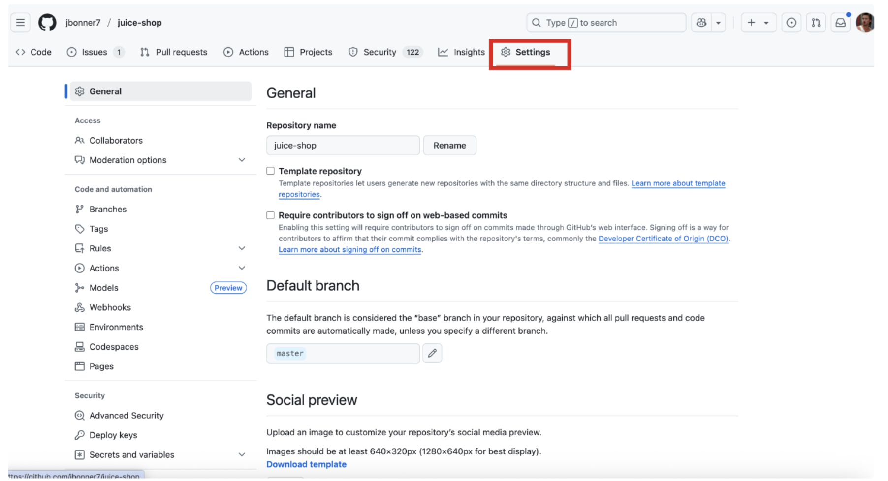
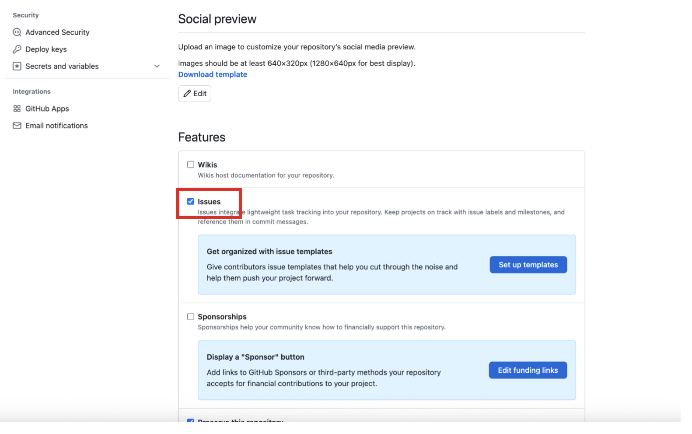
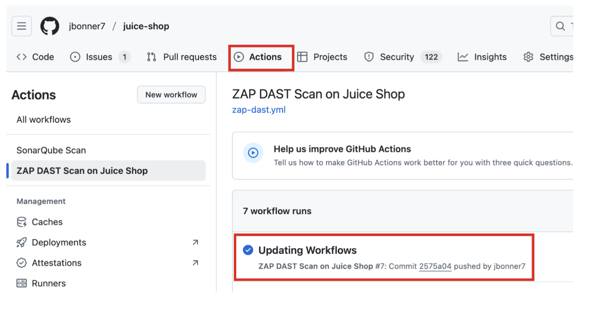
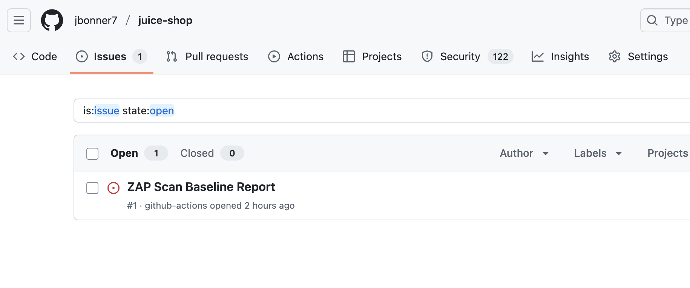
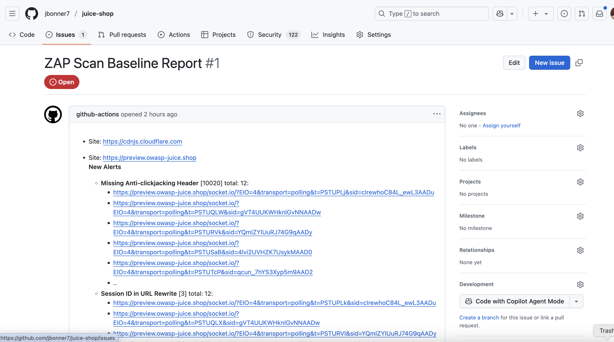

## Session 3

### DAST

While dynamic testing is not a core tenent of code security - mainly because we're dealing with the live application - DAST is still worth mentioning as part of a holistic DevSecOps approach. The same principles that we apply to SAST can be applied to DAST. Ensure the code works, is secure, and free of bugs. More often than not, SAST vs DAST is a decision based on many factors, but there's a place for both. 

In the last section, we built an automation workflow to run and scan the app whenever new code is pushed to the repository. In this example, we'll do the same with a GitHub action that runs a DAST scan using the open source OWASP Zap project. 

#### Enable Issues
We'll do this for our WebGoat and Juice-Shop projects. Since GitHub disables issues on forked repositories - they assume users will submit issues to the upstream repository maintainer - we need to enable Issues so that one can be created after a successful scan.

1. In your repository, navigate to Settings > General. 



2. Scroll down to the "Features" section and check the box next to "Issues."




#### Example Scenario

1. Let's take a look at the following example zap-dast.yml:
```
name: ZAP DAST Scan on Juice Shop

on:
  push:
    branches:
      - master
  pull_request:
    branches: #add whatever branches you want to enforce this on
      - master
      - dev
      - qa

jobs:
  zap_scan:
    runs-on: ubuntu-latest
    name: Scan Juice Shop preview instance on Heroku
    steps:
      - name: Check out Git repository
        uses: actions/checkout@v4.2.2

      - name: ZAP Scan
        uses: zaproxy/action-baseline@v0.14.0
        with:
          token: ${{ secrets.GITHUB_TOKEN }}
          target: 'https://preview.owasp-juice.shop'
          rules_file_name: '.zap/rules.tsv'
          cmd_options: '-a -j'
          fail_action: false  # Do not fail the workflow on alerts; set to true if you want to block PRs
```

2. Let's make a few observations. This action is currently configured to run on code commits to master. It's good that we've done that (it means the scan will run), but we don't want direct commits to master. We've done that here since we're working out of a local environment against a single branch in master. Ideally, we should have a pre-commit hook that denies the commit if the branch is main/master. 

3. Create a file, .git/hooks/pre-commit, with the following content:

```
#!/bin/bash

branch="$(git rev-parse --abbrev-ref HEAD)"

if [ "$branch" = "master" ] || [ "$branch" = "main" ]; then
    echo "You can't commit directly to $branch branch"
    exit 1
fi
```

4. Now, try to re-commit to master. You should see the message "You can't commit directly to $branch branch." Remove the file and continue on with the lab by running:

```
git pull origin master
```

5. To replicate a real-world scenario, we can easily create a new branch for which to submit our new code and run the action against.

```
git checkout -b dev
git branch --set-upstream-to=origin/dev
```

6. We'll commit to our dev branch, and the scan will run and create an issue for the findings. Once the issues are resolved in that branch, a PR can be created to merge the code to the next stage. The idea is that issues should not persist across environments. By having this action enforced for PR's from stage to stage as well as direct commits, you'll ensure that you catch issues at every possible invocation.

#### Create the Action

1. In your local repository, change directories to .github/workflows and create a file called zap-dast.yml. Enter the code from the previous section. 

2. Commit the code to your dev branch and watch the action run!



3. After the action runs, we can see a GitHub issue has been created for our DAST scan!





You've completed this section! You can move on to the next chapter. 