## Session 3

### SAST

In this chapter, we will look at some popular tools for identifying and understanding common flaws in source code. Static Application Security Testing focuses on YOUR proprietary code, and testing your code without actually running the application. The benefit of SAST is that you don't need to provision infrastructure or concern yourself with docker containers just to produce a running application for security analysis. SAST tools are designed to scan the code for common flaws that attackers are experts at finding and exploiting - 

```
Cross-Site Scripting (XSS) 
Cross-Site Request Forgery (CSRF)
Server-Side Request Forgery (SSRF)
Command Injection
Broken Authentication
Remote Code Execution
Buffer Overflow
```

We're going to scan some vulnerable web applications using the sonar-scanner cli tool docker container. 

#### OWASP Juice Shop

1. Fork the following repo and clone into your local machine. 

https://github.com/juice-shop/juice-shop 

##### Create the Local Project
1. In the SonarQube UI, navigate to Projects and click on Create Project. Choose local project.


2. Name the project "juice-shop." Click "Next."

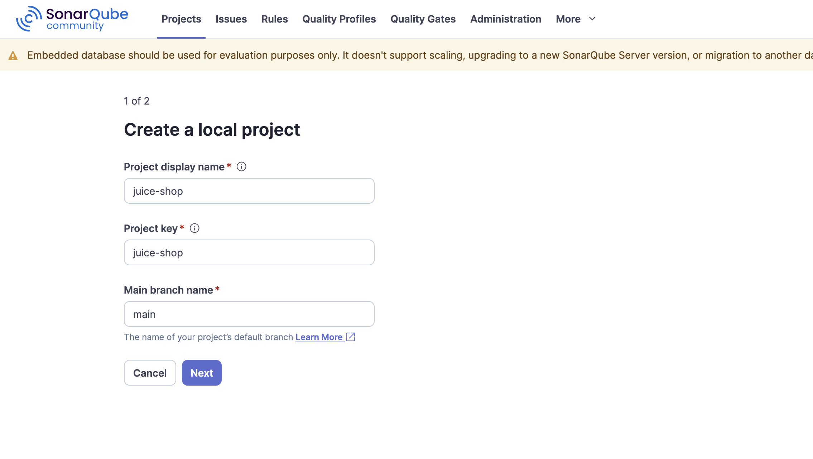

3. Select "Use the global setting" and click "Create project."


4. On the new project landing page, select the analysis method. Choose "Locally."

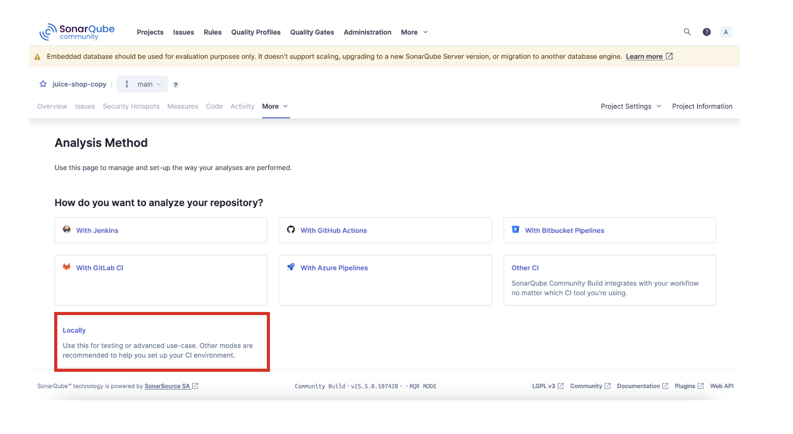

5. Enter a name for the token and click "Generate."

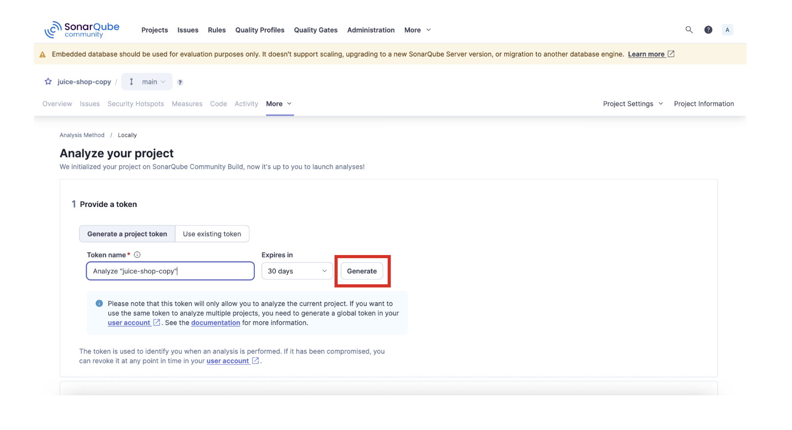

6. Copy your generated token to a secure place, we'll need it for later. Click "Continue."

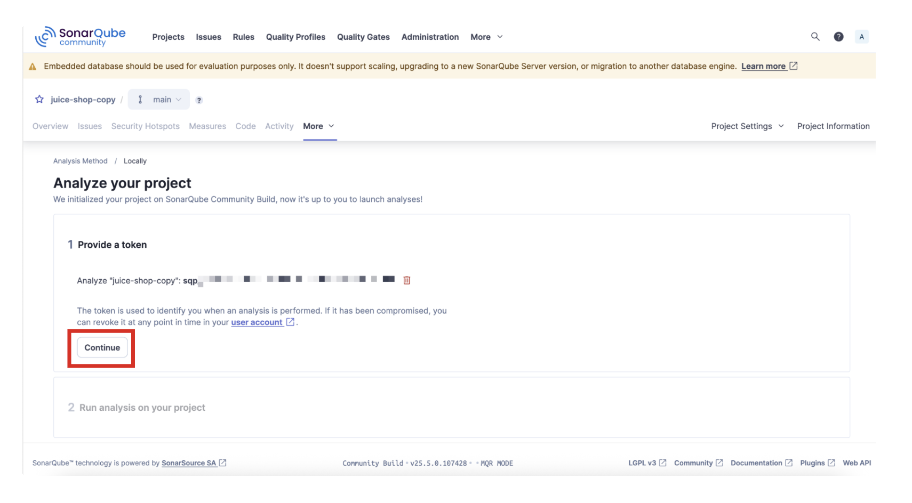

7. For analysis, select "JS/TS & Web." Run the npm install command for your local machine architecture. On MacOS for example, you can install NPM via Brew.

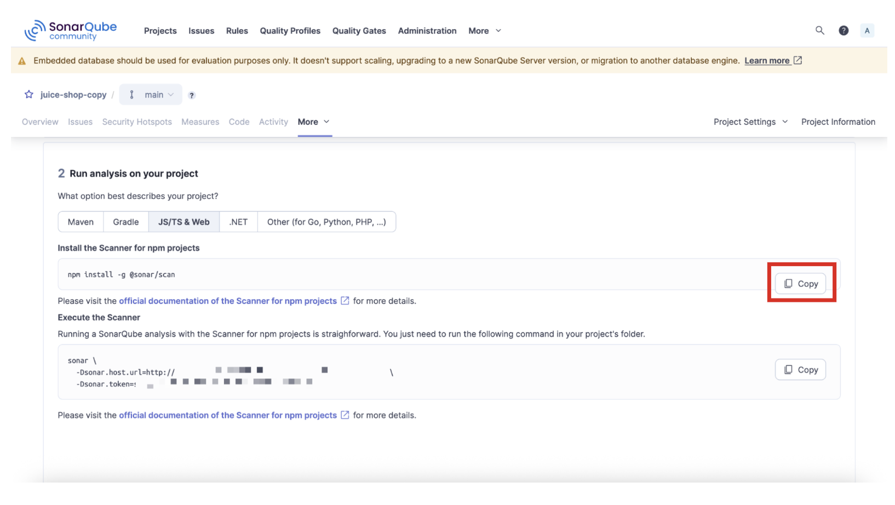

8. You can copy the bottom output to a notepad or text file, but we won't be using this exact command.

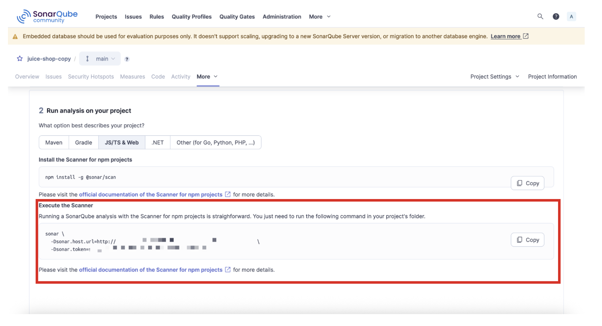


##### Run the Sonar Scanner 

1. We will now use Docker to execute the sonar-scanner with a modified version of the command we copied before. On your local machine, ensure Docker is installed and running. 

2. In your terminal, navigate to the cloned repo directory. 

3. Run the following Docker command to generate a sonar-scanner scan from the CLI against your Juice-Shop project:

```
docker run \
  --rm \
  -e SONAR_HOST_URL="<sonar_url" \
  -e SONAR_TOKEN="<token>" \
  -v "/Users/jbonner/Documents/codesec-workshop/juice-shop:/usr/src" \
  sonarsource/sonar-scanner-cli \
  -Dsonar.projectKey=juice-shop \
  -Dsonar.sources=. \
  -Dsonar.projectBaseDir=/usr/src
```

4. You should see the resultant output for "EXECUTION SUCCESS" in your terminal to signal that the scan ran and generated findings in SonarQube. 

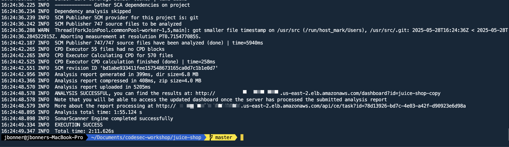

##### Review Code Scan Results in SonarQube

1. Login to SonarQube and click on "Projects > Juice-Shop."

2. Take a look at the landing page for the project. Notice the quality gate passed. Quality gates are a feature of SonarQube that we won't spend too much time on. Just know that the Quality Gates can be configured in different ways, and require a bit more tweaking to assess the state of the scanned code more holistically. 

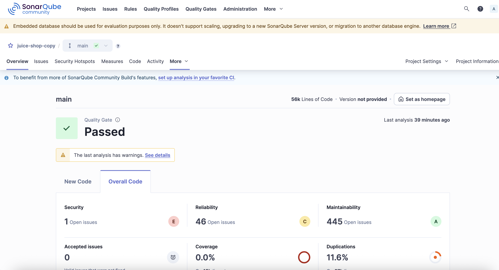

3. For now, click on "Issues." On the left, notice how the findings are organized. We can view issues by Software Quality, Severity, and Clean Code Attributes. We can also filter by Security Category to sort on specific OWASP guidelines. 

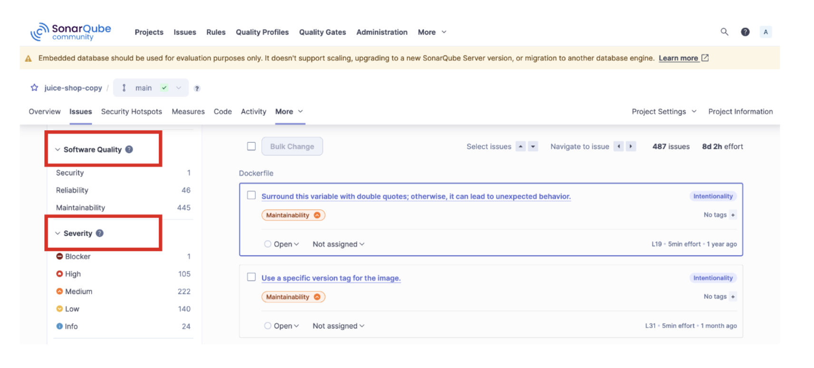


4. Click on the tab "Security Hotspots." 

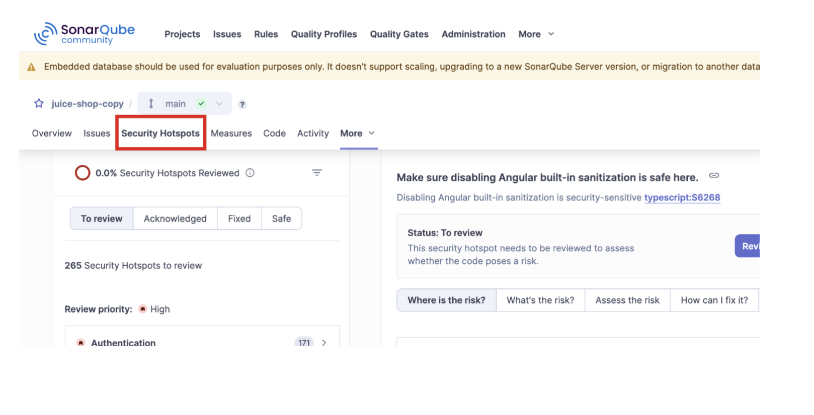

5. Here, we can get a great overview of the issues we're potentially dealing with. Cross-site scripting, code injection, exposed secrets, etc. Click on "Cross-Site Scripting (XSS)." The window pane on the right has some context panels that help you understand what went wrong and how to correct it. 

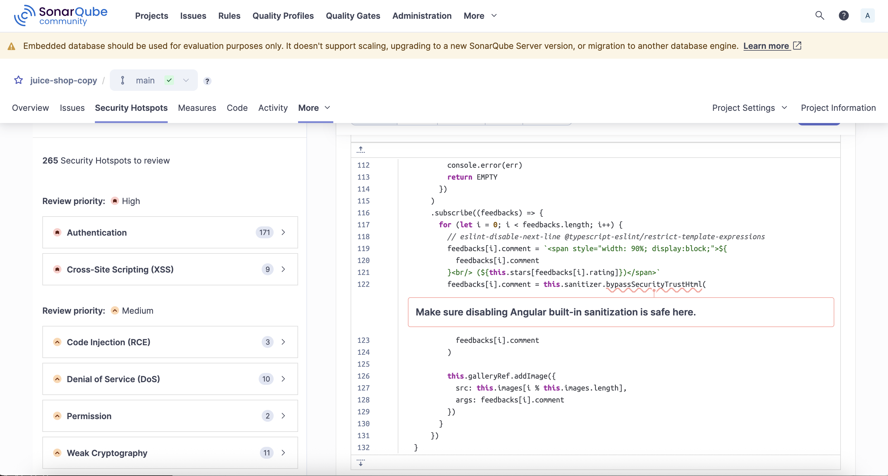

4. In this case, the developer disabled the input sanitization check for Angular. This is something that should never pass the QA stage. 

5. Click on the tabs for "What's the Risk?," "Assess the Risk," and "How can I fix it?" to learn more about the recommendations for avoiding this type of problem. 

6. Expand the "DOS" section. We can see there are a number of issues in code where a denial of service may be possible due to regex backtracking or non-limits on file uploads. There's a lot to unpack here, but just know that these are issues that require careful evaluation. 

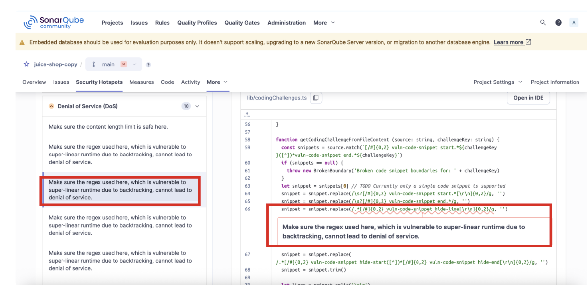


You've completed this section! You can move on to the next chapter. 