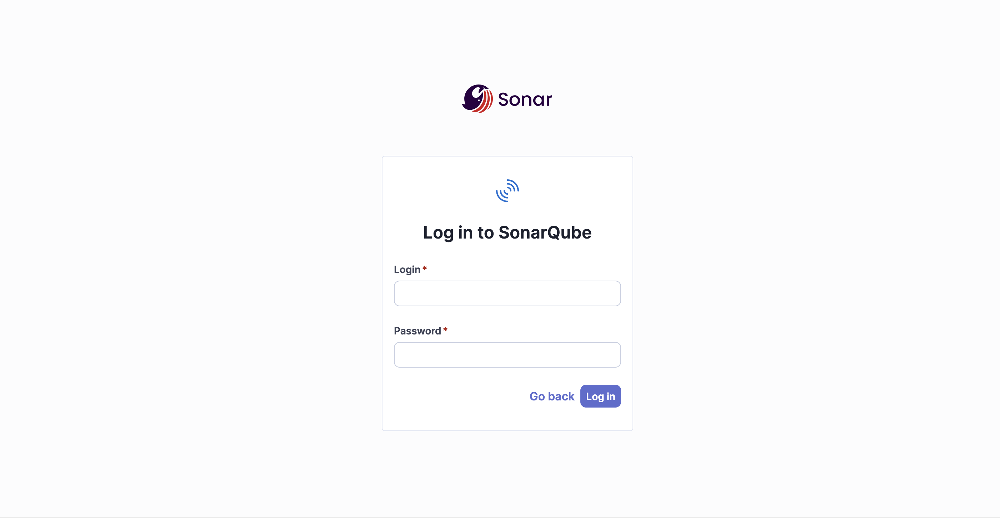

## Session 3

### Install SCA Tools

We will look at some popular tools for identifying and understanding common flaws in source code, specifically dependency problems and licensing issues. SonarQube does not natively support SCA, but SCA findings can be imported using the Dependency Check tool plugin from OWASP. To install the plugin, follow the steps below:

1. Log in to your SonarQube instance



2. Navigate to Administration


3. Click on Marketplace


4. From the Marketplace page, scroll down to the Plugins section. You will notice a disclaimer that third-party plugins are not maintained by SonarQube. Click "I understand the risk" to continue. 


5. Scroll through the list of plugins until you see "Dependency Check" by OWASP. Click on "Install" to the far right of the page.


6. You now need to restart the SonarQube instance. Select the "Restart server" option to initiate a reboot. 


### Clone a Public Repository

We will clone a publicly available repo that we can use for importing SCA findings into SonarQube. WebGoat by OWASP is designed for static application testing and includes some intentional dependency flaws. We will explore these flaws and understand how to resolve them. 

1. Navigate to https://github.com/WebGoat/WebGoat and fork the repository to your GitHub or GitLab account. 

2. From your local terminal, run the following commands:
```
git clone https://github.com/your-username/WebGoat.git
cd WebGoat

```
3. Cd to into your newly cloned repository and open the pom.xml file using your text editor of choice. Add the OWASP Dependency-Check Plugin to the pom.xml using the following code block:

```
<plugin>
  <groupId>org.owasp</groupId>
  <artifactId>dependency-check-maven</artifactId>
  <version>8.4.0</version>
  <executions>
    <execution>
      <goals>
        <goal>aggregate</goal>
      </goals>
    </execution>
  </executions>
</plugin>
```
4. From the top of your project directory, run the following commands to build the project and clean the targets folder:

```
mvn clean install
```

5. We can now move on to the next section.


##### Create the Local Project
1. Back in the SonarQube UI, navigate to Projects and click on Create Project. Choose local project.


2. Name the project "webgoat." Click "Next."


3. Select "Use the global setting" and click "Create project."


4. On the new project landing page, select the anlysis method. Choose "Locally."


5. Enter a name for the token and click "Generate."


6. Copy your generated token to a secure place, we'll need it for later. Click "Continue."


7. For analysis, select "Maven." 


8. You can copy the output to a notepad or text file, but we won't be using this exact command.


##### Run the Sonar Scanner 

1. We will now use Docker to execute the sonar-scanner with a modified version of the command we copied before. On your local machine, ensure Docker is installed and running. 

Verify that your directory structure looks like this:

```
/Users/myuser/Documents/codesec-workshop/WebGoat
├── src/
├── target/
│   └── (Dependency-Check reports will go here)
├── pom.xml
└── sonar-project.properties
```

2. This is a two-step process. First, we need to request an API key from NVD, as Dependency-Check builds a local CVE database in ~/.dependency-check (or /usr/share/dependency-check/data inside Docker), but it doesn’t persist between runs unless you mount a volume. If we don't use an API key, the download can take up to 60 mins. 

Navigate to https://nvd.nist.gov/developers/request-an-api-key to request your key via email. 

3. Once you have your key, run the following commands from the root of your project folder:

```
### Format the code

mvn spotless:apply
```

```
### Build the Project(Skip tests)

mvn clean install -DskipTests
```

4. Ensure the sonar-project.properties file exists in the root of the project folder and has the following contents:
```
# must be unique in a given SonarQube instance
sonar.projectKey=webgoat
sonar.sources=src
sonar.projectBaseDir=.
sonar.dependencyCheck.reportPath=target/dependency-check-report.xml
sonar.dependencyCheck.jsonReportPath=target/dependency-check-report.json
sonar.dependencyCheck.htmlReportPath=target/dependency-check-report.html
sonar.java.binaries=target/classes
```

5. Run OWASP Dependency Check:

```
docker run --rm \
  --platform linux/amd64 \
  -v "$(pwd):/src" \
  -v "$HOME/.dependency-check:/usr/share/dependency-check/data" \
  owasp/dependency-check:latest \
  --project "webgoat" \
  --scan /src \
  --format "ALL" \
  --out /src/target \
  --nvdApiKey <your-valid-nvd-api-key>
```

Your output should look like this:


6. Run SonarQube Scanner:

```
docker run --rm \
  -e SONAR_HOST_URL="http://<sonarqube-host>:9000" \
  -e SONAR_LOGIN="<your-token>" \
  -v "$(pwd):/usr/src" \
  sonarsource/sonar-scanner-cli
```
If successful, your terminal should show a successful analysis:


##### View the Dependency Check Report

1. Back in SonarQube, navigate to the project landing page. Click on More > Dependency Check. The report is now available and opens in a new tab. 


