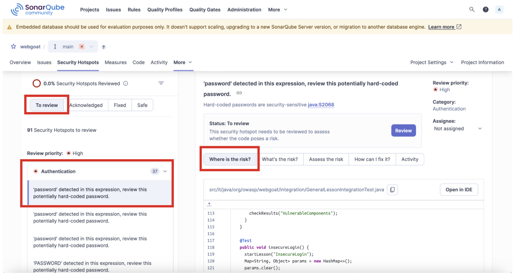

## Session 3

Using SonarQube, we can easily identify that we've leaked secrets into our application code. 

1. Navigate to "Projects" and click on our WebGoat project. 

2. Click on "Security Hotspots."

3. Click on "To Review" and one of the options you will see is an exposed password. Under the authentication results, click on the first result. Then, click on "What's the Risk?"

4. SonarQube highlights the issue in the context panel. We can see that no doubt, secrets were hard coded in the application code. 

**STOP AND THINK**. Why do we highlight something so easily preventable? Surely, no one would ever do this in a live production environment, right? 

Right...?

More than 23.7 million hardcoded secrets were published to GitHub last year, which was 25% more than leaked secrets in 2023, despite the software development platform's intensified efforts to crack down on secret exposures, according to reports from Cybernews.

https://www.msspalert.com/brief/more-than-23-7-million-hardcoded-secrets-publicly-exposed-in-github-last-year