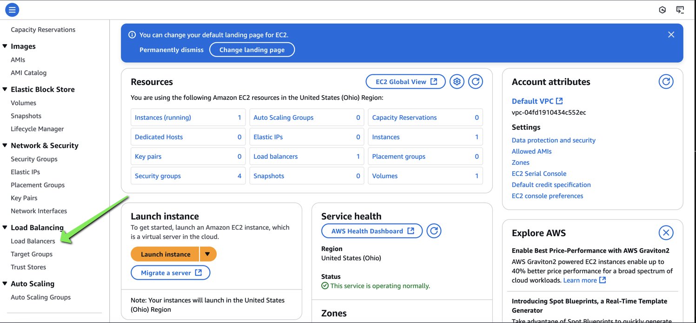
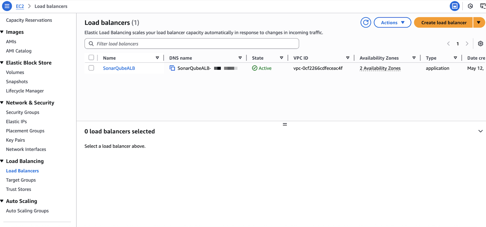
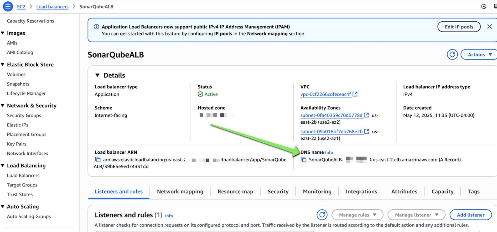
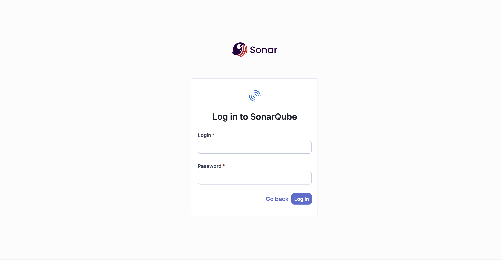

## Lab 2 Overview

In this lab, and in sessions that follow, you will use SonarQube Community Edition to analyze vulnerable applications for common mistakes and learn how to prevent those issues from being introduced into your code. 

SonarQube is an open-source platform that helps developers continuously inspect and improve code quality and security. It performs static analysis to identify bugs, vulnerabilities, code smells, and technical debt across multiple languages. By integrating SonarQube into CI/CD pipelines, teams can catch issues early and maintain cleaner, more secure codebases. .

## SonarQube Instance

Qwiklabs has provisioned an AWS EC2 instance with SonarQube community running as a Docker container. The deployment also consists of an Application Load Balancer, Target Group, and all of the necessary Security Group permissions needed to access the application over the web using HTTP. 

As this is a Code Security workshop, I would be remiss if I did not acknowledge the lack of encryption. The lab is designed for ease-of-use deployment, but it's extremely important to use valid SSL certificates for public web applications!

## Retrieving your SonarQube Instance URL
In the AWS console, navigate to EC2. Scroll down on the left hand navigation pane and click on "Load Balancers." 

Click on the name of the SonarQube ALB.

Copy the DNS name of your Load Balancer and enter into your browser.

You can now login to your SonarQube instance. The default username and password is admin:admin. You'll be prompted to change your password upon first login. 

Once logged in, we can now get started testing!