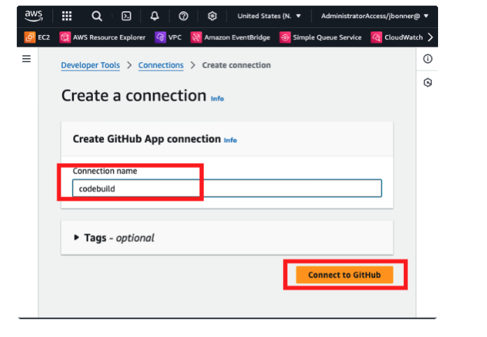
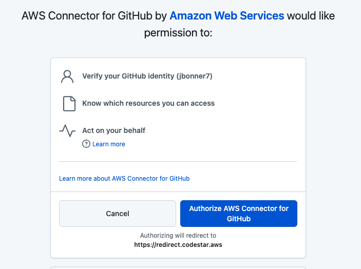

### Lab Exercise

As in previous modules, we'll focus on how we can automate the identification of problematic code earlier in the SDLC. In this lab, we'll perform the following actions: 

* Create your own Terraform demo repository on GitHub
* Set up AWS CodeBuild
* Set up AWS CodePipeline
* Add Checkov scans of Terraform files into CodeBuild

Click **[here](https://fortinet.qwiklabs.com/authoring/labs/33)** to access the lab!

#### Fork the Terragoat Repository

1. We did this in the last module, so we're off to a great start!

#### Connect our Repository to AWS CodeBuild

1. Create a new CodeBuild Project. In the AWS Portal, navigate to AWS CodeBuild and select "Create a Build Project."

2. Name the project and continue with the following configuration details. 

3. You'll need to setup GitHub authentication. Follow the steps below:

4. Once you've saved the credentials, you can move on to configure the remaining CodeBuild settings. 

5. Back on the source settings, you'll now be able to select your cloned repository from your connected account. We did use a public repository here for demo purposes, but setting up app-based authentication should apply to both private and public repositories.

6. Continue with the following configurations:

7. Copy and paste the buildspec.yaml configuration from **[here](https://gist.github.com/jbonner7/d367bb64c669c021757feb972845a6a9)** into the build commands window:

8. Finally, create the project.

9. Now, execute your build project and watch Checkov go to work!

10. You can tail the logs once the build starts. 

11. You'll see that the build failed because violations were found. The complexity and scope of the build criteria in terms of success or failure thresholds can be tweaked based on the security guidelines of the organization. Ideally, no build should pass if there are any violations. If violations are found, they should pass through a review process and explicit approval granted or compensating controls documented in order to bypass. 

#### Set up AWS CodePipeline to Automatically Trigger Scans

1. Now, we will setup AWS CodePipeline to simulate an automated code deployment process with integrated code scanning to alert developers when builds trigger compliance violations on each new commit. 

2. In the AWS console, navigate to AWS CodePipeline and select "Create Pipeline".

3. Select custom pipeline and click "next."

4. Create a name for the pipeline and click "New service role."

5. Select source provider we configured for GitHub earlier (GitHub App), the CodeBuild connection configuration, and the repository name. Leave advanced settings as-is. Click "next."

6. On the build stage page, fill in the details for your CodeBuild project. Make sure the region matches. 

7. Skip the test and deploy stages. We don't to deploy our Terraform scripts to AWS. This lab is meant to highlight how to prevent problematic builds from entering production. 

8. Click "Create pipeline." CodePipeline will immediately run against the latest commit in our Terragoat repository and ultimately fail once Checkov runs. 

Congratulations! You've prevented some really bad Terraform from being pushed into a production cloud environment. 

#### Summary

I hope throughout the course of this workshop that these tutorials have highlighted the need for processes over specific tools. The open source tools we used in these labs are just that - tools. They're only as good as how they're utilized. Many configurations were given defaults, which also means that details matter. Configurations should be given due consideration to how they impact not just the speed of delivery, but also how they affect the organization from a security risk standpoint. 

In the final section, we'll tie it all together and quickly look at some recent examples of how supply chain attacks have negatively impacted organizations and how they could have been prevented.  