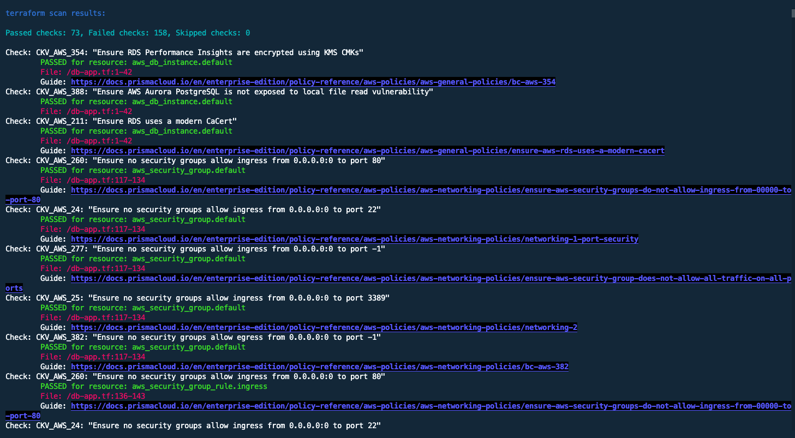
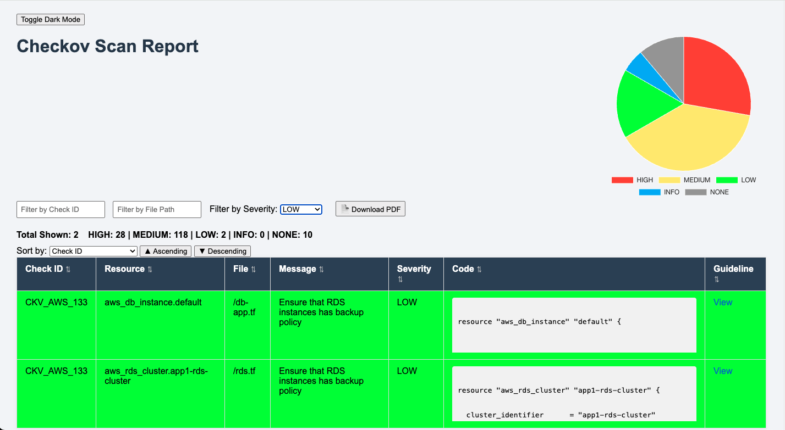
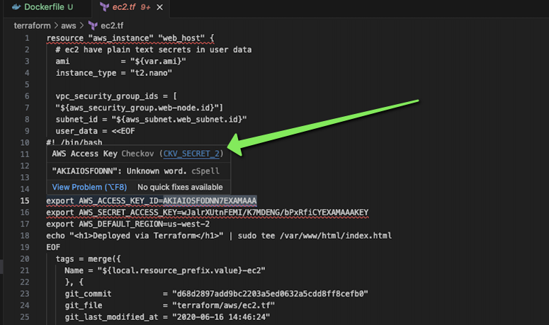

### Lab Exercise

In this lab, we will switch things up from our previous set of tools. After all, variety is the spice of life. We'll use Checkov, a very powerful command line tool for code scanning, to scan another intentionally vulnerable code repository - Terragoat. 

**NOTE:**
The Checkov project was created by Bridgecrew, who was acquired by Palo Alto Networks in 2021 and is now part of Prisma Cloud. Fortinet maintains a fork of Checkov for code scanning purposes. In this lab, we will use the standalone free CLI version of Checkov available from **[GitHub](https://github.com/bridgecrewio/checkov/)**. 

First, let's download and install the required tools. 

**Terragoat:**

```
git clone https://github.com/bridgecrewio/terragoat
```


**Checkov:**

```
Linux: pip3 install checkov

MacOS: brew install checkov
```

1. Run your first scan by navigating to the terragoat/terraform/aws directory. Execute the following scan command:

```
checkov --directory .     
```

2. Review the terraform scan results: 



3. This output is great, but it would look much nicer if we had a web-based GUI to view the results. Let's quickly build one!

4. Make sure you have Docker installed. Create a Dockerfile in the current directory and paste the following:

```
FROM python:3.11-slim

WORKDIR /app

COPY checkov_results.json ./
COPY app.py ./
COPY templates ./templates

RUN pip install flask

EXPOSE 5000

CMD ["python", "app.py"]
```

5. Copy this **[code](https://gist.github.com/jbonner7/f069e357975352a25bae01269db98e45)** and create an app.py file in the same directory. Paste the code into app.py.

6. Create a templates directory and a report.html template file. Copy the following **[code](https://gist.github.com/jbonner7/5c2de5b6202e79f3379995dd0d830a5a)** into the report.html file. 

Run the following commands to build the Docker container and run it:

```
docker build -t checkov-web-report .

docker run -p 5000:5000 -v $(pwd)/checkov_results.json:/app/checkov_results.json checkov-web-report
```

7. Navigate to **[localhost:5000](localhost:5000)** and you'll see your scan results rendered in a visually pleasing html web page!



8. You can filter the results, sort the columns, and download to PDF. This is just one such example of a reporting artifact that makes the lives of application owners and platform administrators much easier. While a nice clean report is nice, we should always be contemplating how to automate the discovery of these issues as early as possible in the development process. There are a variety of ways to do this, as we've discussed so far. 

9. We can use tools like **[CheckovPrismaless](https://github.com/XargsUK/checkov-prismaless-vscode)** in VSCode (for standalone Checkov) to quickly and easily point out problem code as we write.



In the next section, we'll walk through building an automation pipeline in AWS using AWS CodeBuild to evaluate our infrastructure code prior to release. 